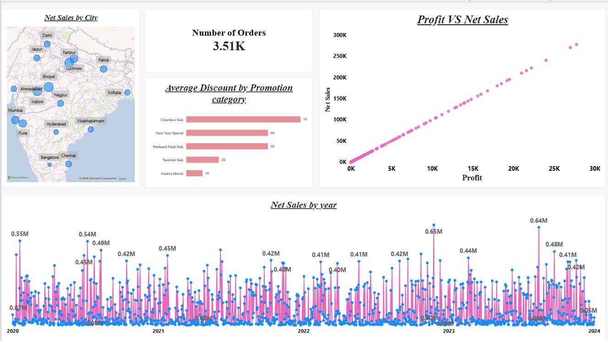
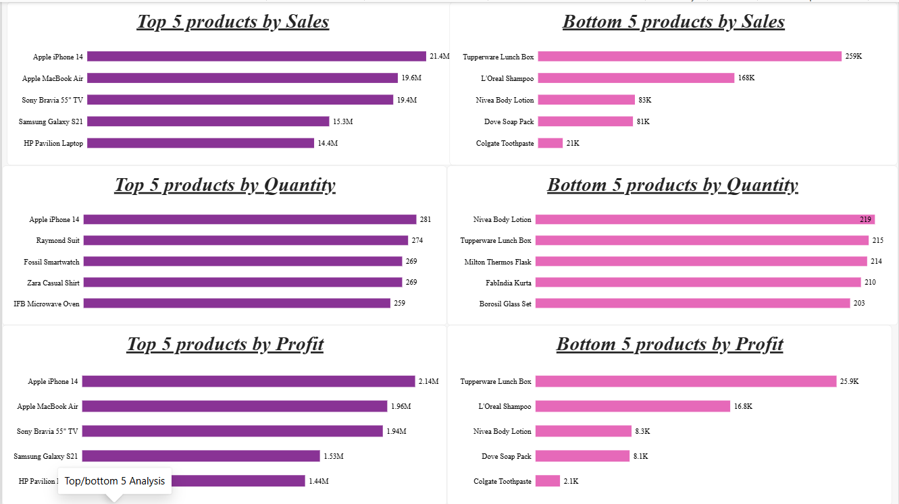
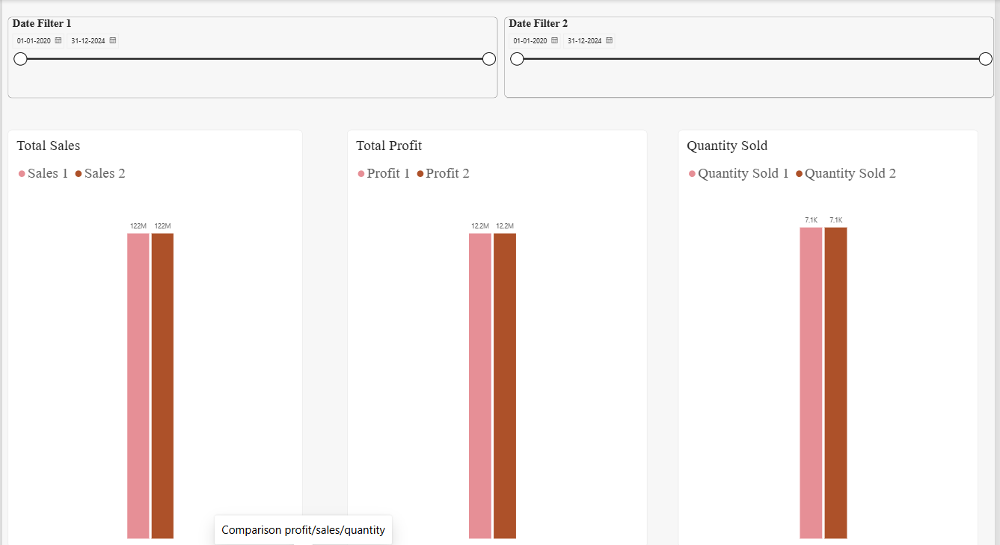
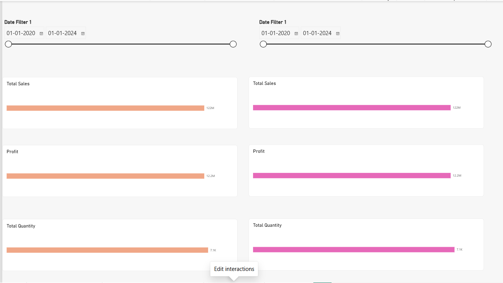
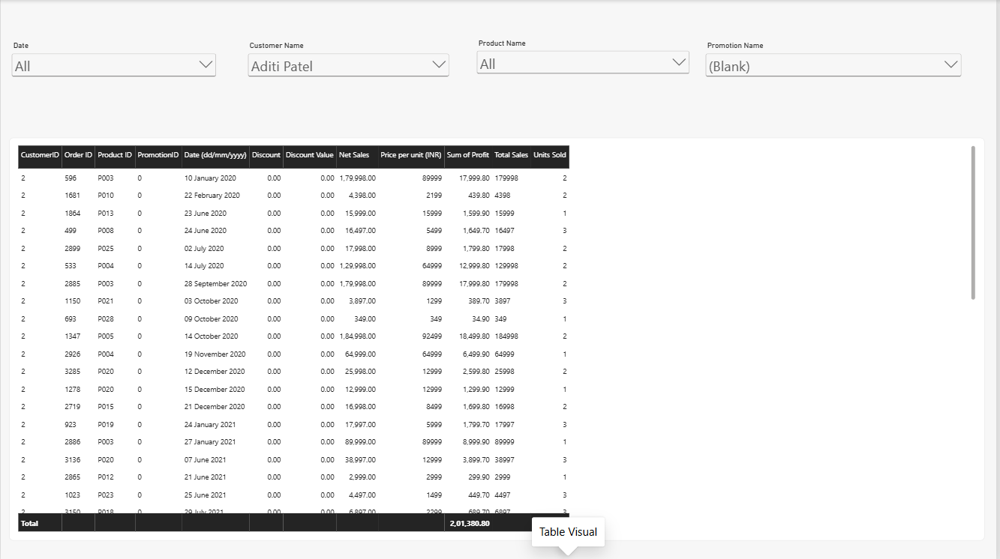

# 📊 ElectroHub Sales Analysis Dashboard | Power BI

> An interactive Power BI sales analytics project covering product performance, sales trends, profitability, period comparison, promotions, orders, and city-level sales.

## 🔎 Project Overview

**ElectroHub Sales Analysis** is an interactive business intelligence dashboard built in Microsoft Power BI.

The project converts transactional sales data into a multi-page analytical report that helps users understand:

- Sales and profitability performance
- Top and bottom performing products
- Sales trends over time
- Relationship between sales and profit
- Performance comparison between two selected periods
- Discount and promotion patterns
- Order-level details
- City-wise sales performance

The dashboard is designed around eight business requirements and uses interactive slicers, visual-level filtering, drill-style analysis, and customized visual interactions.

---

## 🎯 Business Questions

The dashboard answers the following questions:

1. What are the Top/Bottom 5 products by Sales, Profit, and Quantity Sold?
2. How do sales trends vary over time?
3. What is the relationship between Sales and Profit?
4. How do Sales, Profit, and Quantity Sold compare between two selected periods?
5. What is the average discount across promotion/discount categories?
6. What is the total number of orders?
7. What are the sales, profit, discount, net sales, and other details for each order?
8. Which cities generate the highest sales?

---

## 🛠️ Tools & Technologies

- **Microsoft Power BI Desktop** — dashboard and visualization
- **Power Query** — data preparation and transformation
- **DAX** — analytical measures and calculations
- **Data Modeling** — fact/dimension relationships
- **Excel / tabular sales data** — source data used by the report

---

## 📑 Report Pages

### 1. Overview

The Overview page provides a high-level view of sales performance.

Key analysis includes:

- Number of Orders
- Sales trend by year
- Net Sales by city
- Discount by promotion
- Sales vs Profit relationship

**Visual types used:** KPI card, line chart, map, bar chart, and scatter chart.

---

### 2. Top / Bottom 5 Analysis

This page identifies the strongest and weakest products using:

- **Units Sold**
- **Profit**
- **Net Sales**

Top 5 and Bottom 5 product views help stakeholders identify products that are driving performance and products that may require further investigation.

---

### 3. Comparison: Profit / Sales / Quantity

This page supports comparison between two selected periods.

The analysis compares:

- **Net Sales**
- **Profit**
- **Quantity Sold**

Users can select different dates/periods and evaluate changes in business performance.

---

### 4. Edit Interactions

This page demonstrates customized Power BI visual interactions.

The report controls how selected date/period visuals affect:

- Total Sales
- Profit
- Total Quantity

This demonstrates practical use of **Edit Interactions** to control cross-filtering behavior and improve dashboard usability.

---

### 5. Table Visual

The Table Visual page provides detailed order-level analysis.

The table includes fields such as:

- Customer ID
- Order ID
- Product ID
- Promotion ID
- Date
- Discount
- Discount Value
- Net Sales
- Price per Unit
- Profit

The page includes slicers for:

- Date
- Customer
- Product
- Promotion

This allows users to move from summary-level analysis to individual transaction-level investigation.

---

## 📊 Key KPIs & Metrics

The report analyzes the following metrics:

| Metric | Purpose |
|---|---|
| **Net Sales** | Measures sales value after applicable adjustments |
| **Profit** | Measures profitability |
| **Units Sold** | Measures sales volume |
| **Number of Orders** | Measures order volume |
| **Discount** | Analyzes discounting |
| **Discount Value** | Measures discount value |
| **Price per Unit** | Supports product/order-level analysis |

---

## 📈 Key Visualizations

### Sales Trend

A line chart tracks **Net Sales over time**, allowing users to identify changes in sales performance across years.

### Sales by City

A map visual displays **Net Sales by City**, helping identify geographical sales concentration.

### Sales vs Profit

A scatter chart compares **Profit and Net Sales** to help understand the relationship between revenue and profitability.

### Promotion / Discount Analysis

A bar chart analyzes discount values across promotion categories.

### Product Performance

Top/Bottom 5 visuals rank products using sales, profit, and units sold.

### Order-Level Table

A detailed table provides transaction-level visibility and can be filtered using multiple slicers.

---

## 🧩 Data Model

The report uses a fact-and-dimension style model with the following key entities:

```text
                    ┌───────────────┐
                    │   Date Table  │
                    └───────┬───────┘
                            │
                            │
┌───────────────┐     ┌─────▼──────┐     ┌────────────────┐
│  Dim Product  │────▶│ Fact Table │◀────│ Dim Customers  │
└───────────────┘     └─────┬──────┘     └────────────────┘
                            │
                            │
                    ┌───────▼────────┐
                    │  Dim Promotion  │
                    └────────────────┘
```

This model supports analysis across:

- Date
- Product
- Customer
- Promotion
- Sales
- Profit
- Quantity

---

## 🔄 Data Analytics Workflow

```text
Raw Sales Data
      ↓
Data Preparation
      ↓
Data Modeling
      ↓
DAX / Analytical Calculations
      ↓
Interactive Visualizations
      ↓
Business Analysis
      ↓
Insights & Decision Support
```

---

## 🧹 Data Preparation

Power Query was used as part of the data preparation process to make the source data suitable for analysis.

The workflow included:

- Reviewing source fields
- Preparing data types
- Structuring date-related fields
- Organizing fact and dimension data
- Preparing fields required by dashboard visuals
- Validating data before visualization

---

## 💡 Business Value

The dashboard provides a single interactive view for exploring sales performance and supports business users in:

- Identifying high-performing products
- Finding underperforming products
- Monitoring sales trends
- Evaluating profitability
- Comparing performance across periods
- Understanding discount/promotion patterns
- Identifying high-sales cities
- Investigating individual customer orders

---

## 📸 Dashboard Screenshots







---


---


## 🧠 Skills Demonstrated

- Power BI
- Power Query
- DAX
- Data Modeling
- Data Cleaning & Transformation
- KPI Development
- Sales Analysis
- Profitability Analysis
- Time-Series Analysis
- Period Comparison
- Product Performance Analysis
- Customer Analysis
- Promotion / Discount Analysis
- Geographical Analysis
- Interactive Dashboard Design
- Business Intelligence
- Data Storytelling

---

## 👩‍💻 Author

**Tanisha Singhal**

**Data Analyst**

`SQL` · `Power BI` · `Excel` · `Python` · `Data Analysis`

---

## ⭐ Project Summary

> **ElectroHub Sales Analysis transforms transactional sales data into an interactive Power BI dashboard, enabling users to analyze sales, profit, products, orders, promotions, customers, time periods, and city-level performance through dynamic visualizations and filters.**
